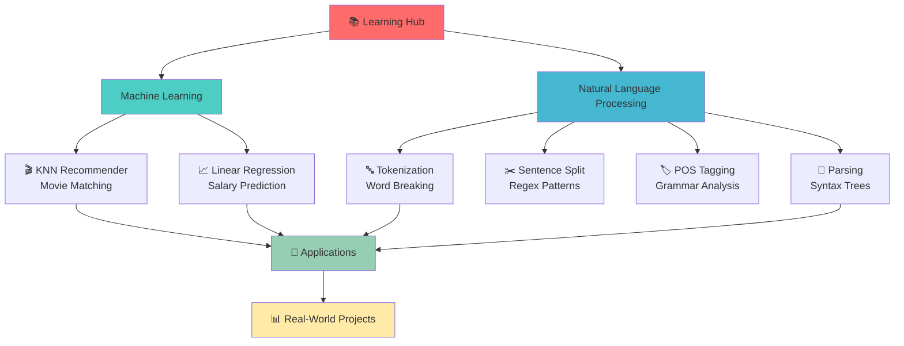

# 🚀 ML & NLP Learning Journey

<div align="center">

[](https://python.org)
[](https://jupyter.org)
[](https://scikit-learn.org)
[](https://www.nltk.org)

```
               ╔═══════════════════════════════════════════════════════════════════╗
               ║                                                                   ║
               ║     🧠 Machine Learning & 📚 Natural Language Processing         ║
               ║                    Comprehensive Learning Hub                     ║
               ║                                                                   ║
║              Explore, Learn, and Build Intelligent Systems        ║
║                                                                   ║
╚═══════════════════════════════════════════════════════════════════╝
```

<p>
  
  
  
</p>

</div>

---

## 📑 Table of Contents

<details>
<summary><b>🔍 Click to expand navigation</b></summary>

- [🎯 Overview](#overview)
- [📂 Project Structure](#project-structure)
- [🤖 Machine Learning](#machine-learning)
- [📖 Natural Language Processing](#natural-language-processing)
- [🔧 Installation & Setup](#installation--setup)
- [🚀 Quick Start](#quick-start)
- [📊 Project Flowchart](#project-flowchart)
- [🎓 Learning Resources](#learning-resources)
- [💻 Technologies Used](#technologies-used)

</details>

---

## 🎯 Overview

This repository is a comprehensive collection of **Machine Learning** and **Natural Language Processing** projects, crafted for learning and experimentation. Each project demonstrates core concepts through practical implementations using real-world datasets and established frameworks.

```
┌─────────────────────────────────────────────────────────┐
 │  🧠 INTELLIGENT SYSTEMS EXPLORATION                  │
├─────────────────────────────────────────────────────────┤
│                                                         │
│  📊 Machine Learning          |  💬 NLP Fundamentals   │
│  ├─ K-Nearest Neighbors       │  ├─ Tokenization        │
│  ├─ Linear Regression         │  ├─ Sentence Split      │
│  └─ Predictive Analytics      │  ├─ POS Tagging         │
│                               │  └─ Grammar Parsing     │
│                                                         │
└─────────────────────────────────────────────────────────┘
```

---

## 📂 Project Structure

```
📦 CLG (Coding Learning Group)
├── 📁 machine_learning/
│   ├── 🎬 knn.ipynb                    [Movie Recommendation System]
│   └── 📈 Linear Regression.ipynb       [Salary Prediction Model]
│
├── 📁 nlp/
│   └── 📁 day_2/
│       ├── 🔤 1.ipynb                  [Word Tokenization]
│       ├── ✂️  2.ipynb                  [Sentence Splitting]
│       ├── 🏷️  3.ipynb                  [POS Tagging]
│       └── 📐 4.ipynb                  [Grammar & Parsing]
│
└── 📄 README.md                         [This File]
```

---

## 🤖 Machine Learning

> *Transform data into intelligent predictions and recommendations*

### 1️⃣ K-Nearest Neighbors - Movie Recommendation System
📂 **File**: `machine_learning/knn.ipynb`

**Purpose**: Build a personalized movie recommendation engine using collaborative filtering

**Key Concepts**:
- Sparse Matrix Representation
- Euclidean Distance Metrics
- K-Nearest Neighbors Algorithm
- Content-Based Recommendations

**Implementation Highlights**:
```python
✨ MovieId × UserId scoring matrix
✨ KNN model with euclidean distance
✨ Scalable recommendation pipeline
✨ Real movie datasets
```

**Dataset**: MovieLens Dataset
- Movies: Titles & Identifiers
- Ratings: User ratings for movies
- Users: Rating patterns & preferences

**Algorithm Flow**:
```
Input: Movie Title
   ↓
Find Similar Movies (KNN)
   ↓
Calculate Euclidean Distance
   ↓
Return Top-N Recommendations
   ↓
Output: Recommended Movies
```

**Code Snippet**:
```python
model = NearestNeighbors(metric='euclidean', algorithm='brute', n_neighbors=6)
model.fit(movie_user_csr)
recommendations = recommend_movie("Toy Story (1995)", n_recommendations=7)
```

---

### 2️⃣ Linear Regression - Salary Prediction Model
📂 **File**: `machine_learning/Linear Regression.ipynb`

**Purpose**: Predict employee salaries based on years of experience using linear regression

**Key Concepts**:
- Feature Scaling & Preprocessing
- Train-Test Split Validation
- Least Squares Optimization
- Model Evaluation Metrics

**Implementation Highlights**:
```python
✨ Linear relationship modeling
✨ 80-20 train-test split
✨ Slope & intercept calculation
✨ Mean Squared Error (MSE)
✨ R² Score evaluation
```

**Dataset**: Salary Dataset
- Features: Years of Experience
- Target: Annual Salary
- Size: Split for training & testing

**Mathematical Foundation**:
$$y = mx + c$$

Where:
- y = Predicted Salary
- m = Slope (coef_)
- x = Years of Experience
- c = Intercept

**Evaluation Metrics**:
```
┌─────────────────────────────┐
│ Mean Squared Error (MSE)    │ → Measures prediction error
├─────────────────────────────┤
│ R² Score                    │ → Model fit quality (0-1)
└─────────────────────────────┘
```

**Visualization**:
```
Salary
   ↑
   │     ••••
   │   •  •••••
   │ •     •••••
   │          •••
   └───────────────→ Experience
   
   Output: Best-fit regression line
```

---

## 📖 Natural Language Processing

> *Master the fundamentals of human language understanding through computation*

### 1️⃣ Word Tokenization
📂 **File**: `nlp/day_2/1.ipynb`

**Objective**: Break text into individual words and analyze token structure

**Concepts Covered**:
- String Splitting Methods
- Token Generation
- Case Normalization
- Frequency Analysis

**Example**:
```
Input:  "Python is a powerful language for Data Science"
   ↓
Tokenization
   ↓
Output: ['Python', 'is', 'a', 'powerful', 'language', 'for', 'Data', 'Science']
   ↓
Lowercase: ['python', 'is', 'a', 'powerful', 'language', 'for', 'data', 'science']
   ↓
Token Count: 8 words
```

---

### 2️⃣ Sentence Splitting with Regular Expressions
📂 **File**: `nlp/day_2/2.ipynb`

**Objective**: Segment text into individual sentences using regex patterns

**Concepts Covered**:
- Regular Expression Patterns
- Sentence Boundary Detection
- Delimiters (., !, ?)
- Text Preprocessing

**Example**:
```
Input:  "Hello world! This is a test. Does it work?"
   ↓
Regex Pattern: (?<=[.!?]) +
   ↓
Output: 
  1. "Hello world!"
  2. "This is a test."
  3. "Does it work?"
```

---

### 3️⃣ Part-of-Speech (POS) Tagging
📂 **File**: `nlp/day_2/3.ipynb`

**Objective**: Identify grammatical role of each word in sentences

**Concepts Covered**:
- POS Tag Classification
- NLTK Tokenization
- Word Type Identification
- Linguistic Analysis

**POS Tag Legend**:
| Tag | Meaning | Example |
|-----|---------|---------|
| NN | Noun | dog, cat |
| VB | Verb | run, jump |
| DT | Determiner | the, a |
| JJ | Adjective | quick, brown |

**Example Analysis**:
```
"The quick brown fox jumps over the lazy dog."
   ↓
Tagged Output:
  The (DT)        → Determiner
  quick (JJ)      → Adjective
  brown (JJ)      → Adjective
  fox (NN)        → Noun ✓
  jumps (VB)      → Verb ✓
  over (IN)       → Preposition
  the (DT)        → Determiner
  lazy (JJ)       → Adjective
  dog (NN)        → Noun ✓
   ↓
Result: 2 Nouns, 1 Verb
```

---

### 4️⃣ Grammar & Parsing
📂 **File**: `nlp/day_2/4.ipynb`

**Objective**: Understand syntactic structure and sentence grammar rules

**Concepts Covered**:
- Context-Free Grammar (CFG)
- Parse Trees
- Syntactic Analysis
- Sentence Structure Validation

**Grammar Rules**:
```
S  → NP VP          (Sentence = Noun Phrase + Verb Phrase)
NP → Det N          (Noun Phrase = Determiner + Noun)
VP → V NP           (Verb Phrase = Verb + Noun Phrase)
Det → 'the' | 'a'   (Determiners)
N → 'fox' | 'dog'   (Nouns)
V → 'chases'        (Verbs)
```

**Parse Tree Example**:
```
        S
       / \
      NP  VP
     /|   /|\
   Det N  V NP
    |  |  | /|
   the fox chases a dog
```

---

## 🔧 Installation & Setup

### Prerequisites
```bash
# Python 3.8 or higher required
python --version
```

### Step 1: Clone or Download
```bash
git clone <repository-url>
cd clg
```

### Step 2: Create Virtual Environment
```bash
# Windows
python -m venv venv
venv\Scripts\activate

# macOS/Linux
python3 -m venv venv
source venv/bin/activate
```

### Step 3: Install Dependencies
```bash
pip install --upgrade pip
pip install -r requirements.txt
```

### Dependencies List
```
pandas==1.3.0          # Data manipulation
scikit-learn==0.24.2   # Machine learning
scipy==1.7.0          # Scientific computing
matplotlib==3.4.2     # Visualization
nltk==3.6.2           # Natural language processing
jupyter==1.0.0        # Notebook environment
```

### Step 4: Download NLTK Data
```python
import nltk
nltk.download('punkt')           # Tokenizer
nltk.download('averaged_perceptron_tagger')  # POS Tagger
nltk.download('universal_tagset')
```

---

## 🚀 Quick Start

### Option 1: Jupyter Notebook (Recommended)
```bash
# Start Jupyter server
jupyter notebook

# Then navigate to desired notebook:
# - machine_learning/knn.ipynb
# - machine_learning/Linear Regression.ipynb
# - nlp/day_2/1.ipynb (through 4.ipynb)
```

### Option 2: Python Script Execution
```bash
# Run individual cells as scripts
python -m jupyter nbconvert --to script knn.ipynb
python knn.py
```

### Running Examples

**Movie Recommendation**:
```python
from machine_learning.knn_recommender import recommend_movie

# Get movie recommendations
results = recommend_movie("Toy Story (1995)", n_recommendations=5)
for movie, distance in results:
    print(f"➤ {movie} (distance: {distance:.2f})")
```

**Salary Prediction**:
```python
from machine_learning.salary_predictor import predict_salary

# Predict salary for 5 years experience
prediction = predict_salary(5)
print(f"$ {prediction:,.2f}")
```

**Text Processing**:
```python
from nlp.tokenizer import tokenize, split_sentences
from nlp.pos_tagger import tag_pos
from nlp.parser import parse_sentence

text = "Hello world! This is a test."
sentences = split_sentences(text)
for sent in sentences:
    tokens = tokenize(sent)
    tags = tag_pos(tokens)
```

---

## 📊 Project Flowchart



---

## 🎓 Learning Resources

### Recommended Reading
📖 **Machine Learning**
- [Scikit-learn Documentation](https://scikit-learn.org/stable/documentation.html)
- [KNN Algorithm Explained](https://en.wikipedia.org/wiki/K-nearest_neighbors_algorithm)
- [Linear Regression Guide](https://towardsdatascience.com/simple-linear-regression-2421fd4e9eb8)

📖 **Natural Language Processing**
- [NLTK Book](http://www.nltk.org/book/)
- [POS Tagging Overview](https://en.wikipedia.org/wiki/Part-of-speech_tagging)
- [Context-Free Grammar](https://en.wikipedia.org/wiki/Context-free_grammar)

### Online Courses
- [Coursera ML Specialization](https://www.coursera.org/specializations/machine-learning-introduction)
- [Stanford NLP Course](https://online.stanford.edu/courses/xcs224n-nlp-deep-learning)
- [Fast.ai Practical Deep Learning](https://course.fast.ai/)

---

## 💻 Technologies Used

<table>
<tr>
<td>

### 🐍 Programming Language
- **Python 3.8+** - Core language
- **Jupyter Notebook** - Interactive environment
- **IPython** - Enhanced shell

</td>
<td>

### 📊 Data Science Stack
- **Pandas** - Data manipulation
- **NumPy** - Numerical computing
- **SciPy** - Scientific computing

</td>
</tr>
<tr>
<td>

### 🤖 ML & AI Libraries
- **scikit-learn** - Machine learning
- **NLTK** - NLP toolkit
- **Matplotlib** - Visualization

</td>
<td>

### 📈 Analysis Tools
- **Statsmodels** - Statistical modeling
- **scikit-image** - Image processing
- **Plotly** - Interactive plots

</td>
</tr>
</table>

---

## 📈 Performance & Metrics

### Machine Learning Models

```
┌──────────────────────────────────────────────┐
│ KNN Recommendation System                   │
├──────────────────────────────────────────────┤
│ Algorithm:        K-Nearest Neighbors       │
│ Distance Metric:  Euclidean                 │
│ K Value:          6 neighbors               │
│ Complexity:       O(n*d)                    │
│ Best For:         Collaborative Filtering  │
└──────────────────────────────────────────────┘

┌──────────────────────────────────────────────┐
│ Linear Regression Model                     │
├──────────────────────────────────────────────┤
│ Algorithm:        Least Squares             │
│ Test Split:       80-20 ratio               │
│ Metrics:          MSE, R² Score             │
│ Complexity:       O(n*m)                    │
│ Best For:         Simple Predictions       │
└──────────────────────────────────────────────┘
```

---

## 🎯 Key Features

<details open>
<summary><b>✨ Highlighted Features</b></summary>

#### Machine Learning
- ✅ Real-world dataset handling
- ✅ Train-test split validation
- ✅ Multiple evaluation metrics
- ✅ Scalable implementations
- ✅ Visualization of results

#### NLP
- ✅ Text preprocessing pipeline
- ✅ Linguistic analysis tools
- ✅ Grammar validation
- ✅ Multiple tokenization methods
- ✅ POS tag classification

#### General
- ✅ Well-documented code
- ✅ Interactive notebooks
- ✅ Practical examples
- ✅ Error handling
- ✅ Type hints

</details>

---

## 🔗 Dataset Sources

| Project | Dataset | Source |
|---------|---------|--------|
| KNN Movie Recommender | MovieLens | Grouplens.org |
| Linear Regression | Salary Data | Kaggle / Education |
| NLP Projects | Custom | Generated Examples |

---

## 📝 Usage Examples

### Quick ML Demo
```python
import pandas as pd
from sklearn.model_selection import train_test_split
from sklearn.linear_model import LinearRegression

# Load and prepare data
X = data[['years_of_experience']]
y = data['salary']
X_train, X_test, y_train, y_test = train_test_split(X, y, test_size=0.2)

# Train model
model = LinearRegression()
model.fit(X_train, y_train)

# Make predictions
predictions = model.predict(X_test)
print(f"R² Score: {model.score(X_test, y_test):.3f}")
```

### Quick NLP Demo
```python
import nltk
from nltk.tokenize import word_tokenize
from nltk import pos_tag

text = "The quick brown fox jumps over the lazy dog."
tokens = word_tokenize(text)
tagged = pos_tag(tokens)

nouns = [word for word, tag in tagged if tag.startswith('NN')]
print(f"Nouns found: {nouns}")
```

---

## 🤝 Contributing

Contributions are welcome! To contribute:

1. Fork the repository
2. Create a feature branch (`git checkout -b feature/amazing-feature`)
3. Commit changes (`git commit -m 'Add amazing feature'`)
4. Push to branch (`git push origin feature/amazing-feature`)
5. Open a Pull Request

---

## 📞 Contact & Support

- 📧 For issues: Open a GitHub issue
- 💬 For discussions: Start a GitHub discussion
- 🐛 For bugs: Submit a detailed bug report

---

## 📄 License

This project is licensed under the MIT License - see the LICENSE file for details.

---

<div align="center">

### ⭐ If you found this helpful, please consider giving it a star! ⭐

```
██████╗ ███████╗██████╗ ███████╗ █████╗ ██████╗ ██╗   ██╗
██╔══██╗██╔════╝██╔══██╗██╔════╝██╔══██╗██╔══██╗╚██╗ ██╔╝
██║  ██║█████╗  ██████╔╝█████╗  ███████║██║  ██║ ╚████╔╝ 
██║  ██║██╔══╝  ██╔═══╝ ██╔══╝  ██╔══██║██║  ██║  ╚██╔╝  
██████╔╝███████╗██║     ███████╗██║  ██║██████╔╝   ██║   
╚═════╝ ╚══════╝╚═╝     ╚══════╝╚═╝  ╚═╝╚═════╝    ╚═╝   
                                                          
    Happy Learning! 🚀 Keep Building, Keep Growing! 💡
```

**Last Updated**: April 2, 2026  
**Status**: Active & Maintained ✅

</div>

---

<details>
<summary><b>📚 Additional Resources</b></summary>

### Cheat Sheets
- [Python Basics](https://www.pythoncheatsheet.org/)
- [Pandas Cheatsheet](https://pandas.pydata.org/Pandas_Cheatsheet.pdf)
- [NLTK Cheatsheet](https://www.nltk.org/howto/)
- [Scikit-learn Cheatsheet](https://scikit-learn.org/stable/)

### Useful Links
- [Python Documentation](https://docs.python.org/3/)
- [Jupyter Documentation](https://jupyter.org/documentation)
- [Stack Overflow](https://stackoverflow.com/)
- [GitHub](https://github.com/)

### Video Tutorials
- ML Tutorials: [3Blue1Brown](https://www.3blue1brown.com/)
- NLP Guides: [Sentdex Channel](https://www.youtube.com/user/sentdex)
- Python Basics: [Tech with Tim](https://www.youtube.com/@techwithtim)

</details>

---

**Made with ❤️ for the Data Science Community**
